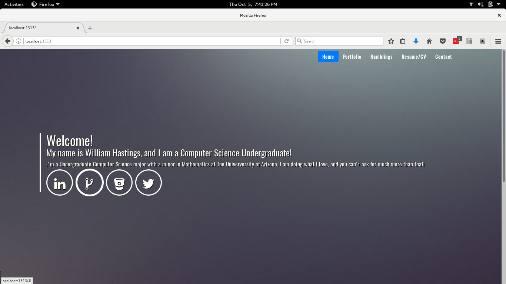

Hello!
======

My website is 100% open source, and anyone is welcome to view/use parts of my code in their own site as long as credit is given. You don't need to add uneccesary extras to you site/or code of mine you've used from _this project_ but at a minimum in the visible comments (Ex. html/css comments)  
  
  
This is is viewable at _(not at the moment)_: [http://williamhastings.me](http://williamhastings.me)  
It is built on the [GoHugo](http://gohugo.io/) static site generate, and themed using [Bootstrap V4](https://getbootstrap.com/)  

Not much more to say, so here is a image of the homepage:  
  

  
  
  
  
  
MIT Copyright
------
```
Copyright (c) 2017 William B. Hastings

Permission is hereby granted, free of charge, to any person obtaining a copy
of this software and associated documentation files (the "Software"), to deal
in the Software without restriction, including without limitation the rights
to use, copy, modify, merge, publish, distribute, sublicense, and/or sell
copies of the Software, and to permit persons to whom the Software is
furnished to do so, subject to the following conditions:

The above copyright notice and this permission notice shall be included in all
copies or substantial portions of the Software.

THE SOFTWARE IS PROVIDED "AS IS", WITHOUT WARRANTY OF ANY KIND, EXPRESS OR
IMPLIED, INCLUDING BUT NOT LIMITED TO THE WARRANTIES OF MERCHANTABILITY,
FITNESS FOR A PARTICULAR PURPOSE AND NONINFRINGEMENT. IN NO EVENT SHALL THE
AUTHORS OR COPYRIGHT HOLDERS BE LIABLE FOR ANY CLAIM, DAMAGES OR OTHER
LIABILITY, WHETHER IN AN ACTION OF CONTRACT, TORT OR OTHERWISE, ARISING FROM,
OUT OF OR IN CONNECTION WITH THE SOFTWARE OR THE USE OR OTHER DEALINGS IN THE
SOFTWARE.
```
